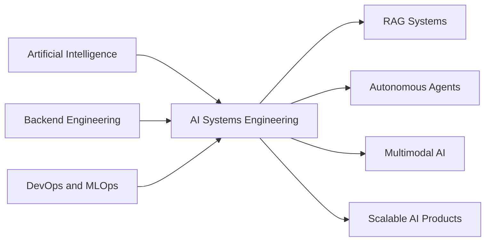

<!-- ====================================================== -->

<!--                    HEADER / BANNER                     -->

<!-- ====================================================== -->

<div align="center">


<br>

<a href="https://github.com/DuranGZR">
  
</a>
<a href="https://www.linkedin.com/in/durangzr">
  
</a>
<a href="https://www.durangezer.com">
  
</a>
<a href="mailto:contact@durangezer.com">
  
</a>

<br><br>


</div>

---

<!-- ====================================================== -->

<!--                         ABOUT                          -->

<!-- ====================================================== -->

<div align="center">

## `SYSTEM.IDENTITY`

</div>

```yaml
name: Duran Gezer
location: İzmir, Türkiye

focus:
  - Artificial Intelligence
  - RAG Systems
  - Autonomous AI Agents
  - Backend Architecture
  - Computer Vision
  - MLOps and DevOps

currently_exploring:
  - Advanced RAG architectures
  - Agentic AI workflows
  - Multimodal AI systems
  - High-performance inference
  - Scalable backend systems
  - Production-ready AI deployment
```

<div align="center">

I focus on building intelligent software systems by combining
**Artificial Intelligence, Backend Engineering and DevOps.**

<br>

My main goal is to transform AI models into
**scalable, maintainable and production-oriented systems.**

</div>

---

<!-- ====================================================== -->

<!--                      FOCUS AREAS                       -->

<!-- ====================================================== -->

<div align="center">

## `CORE.FOCUS`

<br>


<br>


</div>

---

<!-- ====================================================== -->

<!--                       TECH STACK                       -->

<!-- ====================================================== -->

<div align="center">

## `TECH.STACK`

### Artificial Intelligence


<br><br>


<br>


### Backend & Database


### Frontend


### DevOps & Engineering


</div>

---

<!-- ====================================================== -->

<!--                     GITHUB STATS                       -->

<!-- ====================================================== -->

<div align="center">

## `GITHUB.ANALYTICS`

<br>


<br>


<br><br>


</div>

---

<!-- ====================================================== -->

<!--                       TROPHIES                         -->

<!-- ====================================================== -->

<div align="center">

## `ACHIEVEMENTS`

<br>


</div>

---

<!-- ====================================================== -->

<!--                    ACTIVITY GRAPH                      -->

<!-- ====================================================== -->

<div align="center">

## `CONTRIBUTION.ACTIVITY`

<br>


</div>

---

<!-- ====================================================== -->

<!--                    PROFILE SUMMARY                     -->

<!-- ====================================================== -->

<div align="center">

## `PROFILE.SUMMARY`

<br>


</div>

---

<!-- ====================================================== -->

<!--                  DEVELOPMENT DIRECTION                 -->

<!-- ====================================================== -->

<div align="center">

## `DEVELOPMENT.DIRECTION`

</div>



---

<!-- ====================================================== -->

<!--                       PHILOSOPHY                       -->

<!-- ====================================================== -->

<div align="center">

## `ENGINEERING.PHILOSOPHY`

<br>


<br>

> **A model is only the beginning.**
> Real engineering starts when it becomes a reliable system.

</div>

---

<!-- ====================================================== -->

<!--                        FOOTER                          -->

<!-- ====================================================== -->

<div align="center">

### Let's build intelligent systems.

<a href="mailto:contact@durangezer.com">
  
</a>

<br><br>


</div>
